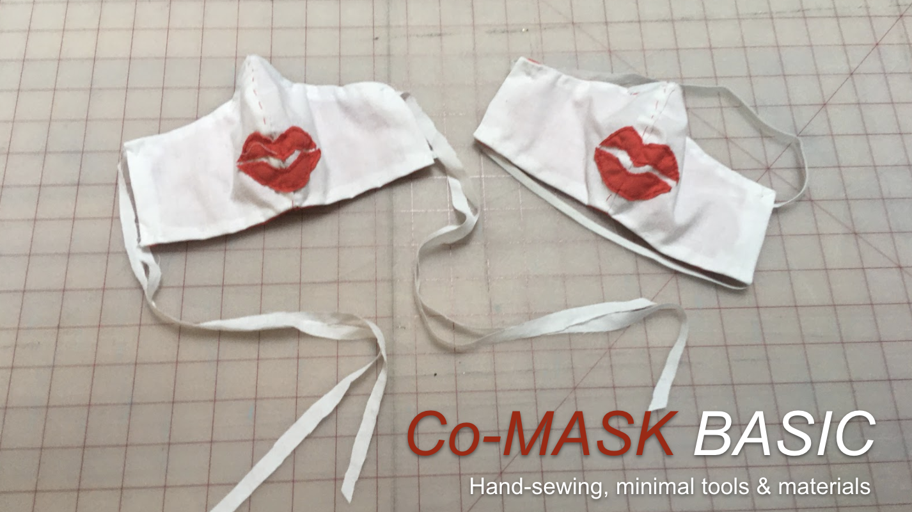

# Welcome to Co-MASK

|How to make:||||
|:--|---|---|---|
| اَلْعَرَبِيَّةُ | Deutsch | Italiano | اُردُو |
| Bosanski   | ελληνικά | 한국어/韓國語 | Tiếng Việt |
| kreyòl ayisyen | ગુજરાતી | Português |  |
| [English](https://docs.google.com/presentation/d/1T_rO2Q8HKdWN_8hhGp65-JKylpn2vpFx0kGD602U618/edit?usp=sharing) | [עִבְרִית‎](https://docs.google.com/presentation/d/1cNT-sOp2vS-0BuAuIIPzrBh3zdez-ZKLi3l8RrRI3sY/edit?usp=sharing) | [Español](https://docs.google.com/presentation/d/1LXYo50ZgN1rFB-5t_2WhzbM1kg1Z7gD_UUVFEN1SblE/edit?usp=sharing) |     |
|Français|हिन्दी-उर्दू|Türkçe||

Translations in progress, contact us if you want to add your language.

We invite you to join a global project to create fabric masks that promote hope, humanity, and hygiene practices in time of crisis. Collaborating across borders, we want to raise awareness about the risks of COVID-19 infection and the need for physical distancing, advocating solidarity. 

Kiss and smile at a safe distance!

The project offers instructions in many languages for how to make masks in individual sizes. All you need are materials you will likely find at home: a cotton T-shirt, a kitchen cloth, and non-woven fabric. You do not need a sewing machine; scissors, thread, and needle will be enough. The masks are washable, have a nose clip, and allow you to insert a replaceable filter, such as a surgical mask. **While the Co-MASK cannot prevent an infection with the Coronavirus, it offers some protection from larger droplets and prevents you from touching your face**. We are currently translating the mask instructions into many languages–you are welcome to help. We hope to inspire you to create these masks for your family, friends, and your community. Please wash your hands and the masks before disseminating and be careful to distribute them without direct physical contact. 

Create your own mask with a kiss and a smile, post it on social media with the hashtag **#CoMASK**

