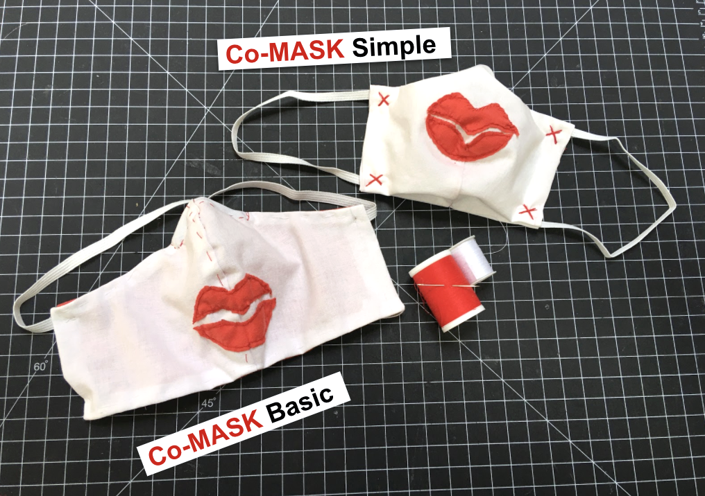

# How to Co-MASK

|How to make:||||
|:--|---|---|---|
| [اَلْعَرَبِيَّةُ](https://docs.google.com/presentation/d/1c4zXEowPAIgQcasyMvJvLNEohecMwBvjLJr82WEY9nU/edit?usp=sharing) | [ગુજરાતી](https://docs.google.com/presentation/d/1yMhNrhVc02ptqK3gul5Z-JmK5Wz6Xme18IYk34kz90I/edit?usp=sharing) | [Македонски јазик](https://docs.google.com/presentation/d/1J5Xn39DEPJGAu11cEJAU6jVe7WKD11tXWP7bpP5ClAY/edit?usp=sharing) | [Tiếng Việt](https://docs.google.com/presentation/d/1ctL3x1vGUNbWFwoVEHvtWB3dTTYwhLf7mCxSTDZso3o/edit?usp=sharing) |
| [Bosanski](https://docs.google.com/presentation/d/1Wo35d7BZaEPhtMg0TuXQrnP0szMFHge_3etbAyDg__4/edit?usp=sharing) | [עִבְרִית‎](https://docs.google.com/presentation/d/1cNT-sOp2vS-0BuAuIIPzrBh3zdez-ZKLi3l8RrRI3sY/edit?usp=sharing) | [한국어/韓國語](https://docs.google.com/presentation/d/1MSDEfAQ_TDWf14yAfKbZgJvZ3HnY3I51Qqd50tawSSw/edit?usp=sharing) | [தமிழ்](https://docs.google.com/presentation/d/16wu1WctaFuU-JPeHeJn5VZT9-NVIj84GiU8-2YeXiGw/edit?usp=sharing) |
| [Deutsch](https://docs.google.com/presentation/d/1PFxRqqfLwhkqDWGTxXlwi_zWoegKpmUAv-mcQOVGjkQ/edit?usp=sharing) | [हिन्दी](https://drive.google.com/file/d/13ePhPcpwqdoP1s0ow2B_GQUv7neMqIhf/view?usp=sharing) | [Português](https://docs.google.com/presentation/d/1k7DGbnfYzxcFBW5vOmlco_-1Y9bfZ-5FkDBA2iAVzoU/edit?usp=sharing) | [русский язык](https://docs.google.com/presentation/d/1ICBEGSqWGv77sltmagEMounJvhpGmTy_wgziBZPkJ0s/edit?usp=sharing) |
| [English](https://docs.google.com/presentation/d/1T_rO2Q8HKdWN_8hhGp65-JKylpn2vpFx0kGD602U618/edit?usp=sharing) | [Italiano](https://docs.google.com/presentation/d/1_RHBFR9ubGLrgpFGF5re_CpbbsZj4yRjeo9oioCYMM0/edit?usp=sharing) | [Español](https://docs.google.com/presentation/d/1LXYo50ZgN1rFB-5t_2WhzbM1kg1Z7gD_UUVFEN1SblE/edit?usp=sharing) | [বাংলা](https://drive.google.com/file/d/1x0Zg2ljfss3e7ewH3RUgsDz8BkDk0pJW/view?usp=sharing) |
|[Français](https://docs.google.com/presentation/d/1H5tWf3gtuaeDWoVCub0vQIlLQSlLNcrS66FRDp7clnk/edit?usp=sharing)|[ಕನ್ನಡ](https://drive.google.com/file/d/1ieR4GluTDGDIAKGpEBvO1F3S1BGUKwqN/view?usp=sharing)|[Slovenščina](https://docs.google.com/presentation/d/1CRa1snrNdU6x1cxTsMqAMStENCoHXgZ3_bzbxVPngOo/edit?usp=sharing)|[中文](https://drive.google.com/file/d/1x0Zg2ljfss3e7ewH3RUgsDz8BkDk0pJW/view?usp=sharing)|
|[ελληνικά](https://docs.google.com/presentation/d/1wxX9T3keWJAIGZngB93HFvJZnJ3-_6vaQDpDb8kAoH0/edit?usp=sharing)|[Kiswahili](https://drive.google.com/file/d/1kifC_CVGkABFKkBGYepTEFmdtYuc3rmB/view?usp=sharing)|[Türkçe](https://docs.google.com/presentation/d/1zsKw7xeurfuEbOJjGvUP_igr3cMyd7Jflbu0kfEKD1Y/edit#slide=id.g71aa90b52d_0_0)|українська мова|

Translations in progress, contact us if you want to add your language.

We invite you to join a global project to create fabric masks that promote hope, humanity, and hygiene practices in time of crisis. Collaborating across borders, we want to raise awareness about the risks of COVID-19 infection and the need for **physical distancing and self-isolation, while advocating solidarity with the most vulnerable in our global community.** 

Kiss and smile at a safe distance!

The project offers instructions in many languages for how to make masks in individual sizes at home. All you need are materials you will likely find at home: a cotton T-shirt, a kitchen cloth, and non-woven fabric. You do not need a sewing machine; scissors, thread, and needle will be enough. The masks are washable, have a nose clip, and allow you to insert a replaceable filter, such as a surgical mask. **While the Co-MASK cannot prevent an infection with the Coronavirus, it offers protection from larger droplets and prevents you from touching your face. Suppression and self-isolation are the only measures proven to protect the larger community!** 

We hope to inspire you to create these masks for your family, friends, and your community to advocate self-isolation, hygiene, and heartfelt human connection. Please [wash your hands and the masks](https://www.who.int/emergencies/diseases/novel-coronavirus-2019/advice-for-public/when-and-how-to-use-masks) before disseminating and be careful to distribute them without direct physical contact. 

Create your own mask with a kiss and a smile, post it on social media with the hashtag **#CoMASK**

**More information about the virus and hygiene measures:**

[CDC Recommendation: Why we should all wear masks!](https://www.actionnewsjax.com/news/trending/coronavirus-do-we-all-need-wear-masks-cdc-is-considering-it/PCJ27GQOBJHZDCZ7ESEUOXM57M/)

[CDC: How to protect yourself and others](https://www.cdc.gov/coronavirus/2019-ncov/prepare/prevention.html)

[CDC: How to disinfect your home, especially if you are sick](https://www.cdc.gov/coronavirus/2019-ncov/prepare/cleaning-disinfection.html)

[CDC guidelines on how to keep your workplace safe](https://www.cdc.gov/coronavirus/2019-ncov/downloads/workplace-school-and-home-guidance.pdf)

**More information about masks, their hygiene and effectiveness**:

[WHO advice: when and how to use the masks](https://www.who.int/emergencies/diseases/novel-coronavirus-2019/advice-for-public/when-and-how-to-use-masks)

[A comparative study of fabric masks vs. medical masks](https://bmjopen.bmj.com/content/5/4/e006577)

[Scientific testing:  What is the efficacy of the homemade masks?](https://www.cambridge.org/core/journals/disaster-medicine-and-public-health-preparedness/article/testing-the-efficacy-of-homemade-masks-would-they-protect-in-an-influenza-pandemic/0921A05A69A9419C862FA2F35F819D55)

[Risks on getting infected though improper use of masks](https://www.cbsnews.com/news/coronavirus-prevention-face-mask-not-helpful-wash-hands/)

[Should you be wearing a mask? Experts disagree](https://www.livescience.com/coronavirus-do-face-masks-work.html)

[A shared open source document on DIY masks and resources](https://bit.ly/diycovidmasks) 

**Donate your masks:**

[Cambridge Health Alliance accepting mask donations](https://www.bostonglobe.com/2020/03/17/metro/cambridge-health-alliance-accepting-mask-donations-amid-coronavirus-pandemic/)

[Forbes article: Calling for mask makers to address healthcare worker PPE shortage](https://www.forbes.com/sites/tjmccue/2020/03/20/calling-all-people-who-sew-and-make-you-can-help-solve-2020-n95-type-mask-shortage/?fbclid=IwAR0NsmbXPKeVfUDz3MtjHyElnb9QrAzLfYfasiexVrScos7pwdN2uXjfZmw#5be7bfae4e41)

**Other excellent DIY masks with video instructions:**

[Simple formfitting mask using just one sheet of fabric](https://www.youtube.com/watch?v=WlguehtIpu8) (machine needed)

[Face fitting HK Mask with sewing patterns in for babies, children and adults](https://diymask.site/) (machine needed)

[Instructions for a simple surgical mask style mask](https://www.instructables.com/id/AB-Mask-for-a-Nurse-by-a-Nurse/)  (machine needed)

[Download the PDF sewing pattern for the Co-MASK Basic type](https://www.infirmiers.com/pdf/masque-tissu.pdf) (printer needed)

[Youtube video instructions - how to modify the MERV13 filter for the mask](https://youtu.be/6T787NV6FpA)

